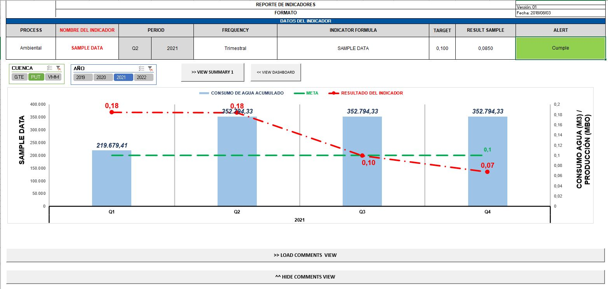

# Data Management System

This is a business solution with built-in automation for KPI estimations and data handling in MS Excel (data reporting) and a relational database service provider (data storage in SQL server or MS Access).

## Overview

Transactional data is collected in 45 different worksheets in Excel and Access and later It has to be centralized and consolidated in a single data base repository. This task is automated through VB Macros and ADO connections executed in windows forms apps, which continously populate workbook datasets validating data consistency and cleaning. Additionally, the userform tracks data that has been overwritten, deleted or added by any user providing a dynamic log of changes.

## Packages
The following package classes must be imported in the VBA developer tab to execute the data repository userforms and macros:

1. Microsoft Excel 16.0 Object Library
2. VBA OLE Automation library
3. Microsoft Windows Forms 2.0 Object library
4. AppxManagerLib
5. Microsoft ActiveX Data Objects 6.1 library

## Usage
The .bas and .vb files can be imported and adapted according to different needs related to automatic data manipulation with Excel developer VBA. 
The Excel templates must keep the same worksheet name structure used in the macros. 

To test runtime execution of macros and windows forms, download the .xlsm files from Source > Debugging root folders.

Data handling structure:
1. Sample data input .xlsm files gather data in separate datasets. The internal spreadsheet formats guide the user who inputs monthly operational data
2. The data repository .xlsm file centralizes all datasets and builds dashboards for each KPI report. The main user sheet contains several buttons that open forms where all data sets can be loaded in a synchronized and logical way.
3. When dataset import macros finish their execution, the data repository workbook must be refreshed updating all reporting dashboards
4. The dashboard menu .xlsm file reports corporate level data that summarizes the data repository dashboards. This file, displays a dynamic menu that helps the user navigate through all data views.
 

## Layout
 

### User Dashboard Access
 

 

 

### Data Entry Dashboard
 

 

 

### KPI Database Dashboard
 

 

### Database Update Form
 

 

### Data Report Summary Forms
 

 

 

 

 

### BI Report Views
 

 

 

